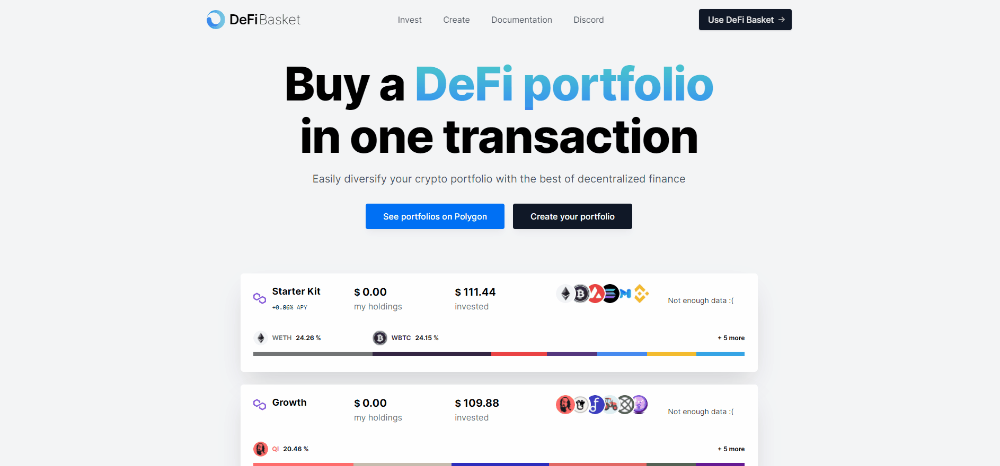

# 🍯 Cloning a Basket

DeFi Basket enables you to easily clone a basket with a single transaction, no matter how complex it may be. You just choose the amount to be deposited and approve the transaction. In a few minutes it should be ready for you to manage.

&#x20;You can check a list of baskets [here](https://www.defibasket.org/portfolios).

To copy a basket, click on **`Launch App`** to initiate **Explore** our section. In this screen, select the basket you want to copy. This will show you the details of the basket allocation and the current invested money on it.&#x20;

Click on the **`Clone`** button, then select the token for deposit and input the amount you want to invest in your basket. When finished, click on **`Preview Transaction`**. In the next window you'll be able to verify all transactions required to generate your basket. Finish by clicking on **`Clone Portfolio`** and approving the transaction with your wallet of choice.

You'll be required to perform two approvals with gas costs:

1. Approve DeFi Basket to use the amount you're depositing (usually very low gas)
2. Approve the single transaction to create your basket and invest in the selected assets (gas costs depends on the complexity of the selected assets)

> **IMPORTANT**: Remember to keep some native tokens to pay for gas costs, otherwise your transaction may fail.

Your basket will be available on the My Baskets page as soon as the transaction gets processed on DeFi Basket's backend. This may take a few minutes. Rest assured that your transaction is safe and sound as soon as Polygon processes it (a notification will be shown on the top right corner of the screen).&#x20;
