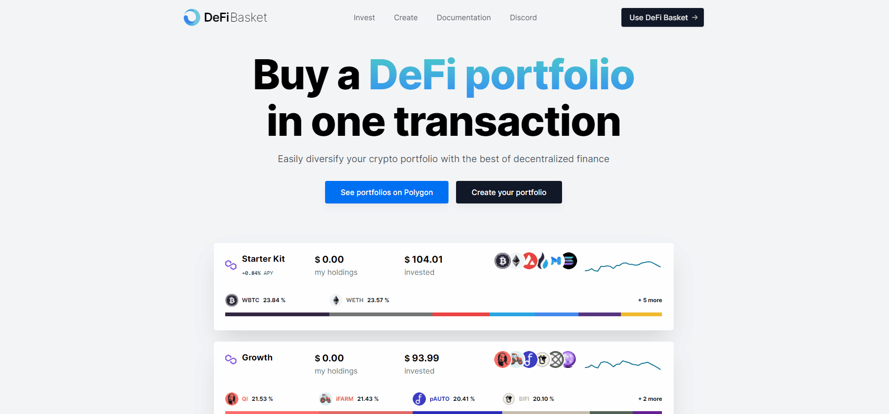

# 🆕 Creating a Basket

You can create your own basket of assets following your own investment criteria. You  have the option to set the desired allocations in our UI and to buy them with just one transaction. You can do it [here](https://www.defibasket.org/create).

First, click on **Create**. In this screen, you will be able to select the assets that will be included in your portfolio and their proportions (in USD). We support integration with **Aave**, **Autofarm, Harvest**, **Balancer**, many **ERC20** tokens, among others. You can filter the assets based on its type. If an asset is not present in the asset list, but you want us to include it, [send us a message](mailto:hi@defibastket.org)! :smile:

After this step is done, click on **Next Step** and select the token which you want to deposit the initial funds. Then, click on **Next Step**.

In the next window you will be able to review all the transactions we're generating to implement your basket. If everything is ok, you can proceed to the wallet authorization by clicking on the <mark style="color:blue;">**Create Portfolio**</mark> button. If you want to edit or check your portfolios later, click on **My Baskets**  (or click directly in [this link](https://defibasket.org/my-portfolios/)).

## How to share a basket?

If you have a basket you would like to share, you just go into the basket and click on the Share button.&#x20;
